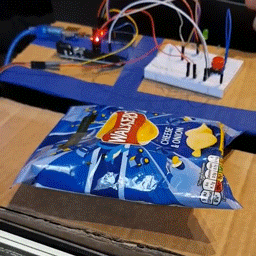

# Smart Waste
Waste collection and management using IoT and Computer Vision.


## Arduino

### Wiring


### Pinout

The pintout for Arduino can ba changed in `arduino/Bin.ino`:

```c++
const int trigPin = 9;
const int echoPin = 10;
const int ledPin = 13;
const int buttonPin = A2;
```

## Camera

Spy camera is used for Computer Vision.


## Sensor

Ultrasonic sensor is used to detect the capacity of bin.


## Python

### Dependencies

Install Keras from PyPI:

```sh
sudo pip install keras
```

Install TensorFlow and OpenCV from GitHub source.

## Demo

Connect machine to Arduino and run `python/predict.py`.

### Recycling with computer vision

Recyclable wastes will be dropped inside the bin.




Non-recyclable wastes will be dropped outside the bin.


### Bin capacity detection

If the bin is full, green LED will light up.


### Route planning with OptimoRoute and Google Map Services

Once bin is full, its address will be uploaded and an order for waste pick up will be submitted to the OptimoRoute website. The best route can be obtained from API and plotted using Google Map.


## Inspiration

Having gone through projects available for Hack Cambridge 101, we are inspired by the Smart Waste challenge put forwarded by Reply. This is because current wasting collection system is really inefficient and a lot of resources has been wasted during the recycling process. There is an urgent need for improvement

## What it does

Our system has a number of key functions:

- Classifies incoming waste into categories (Recyclable/Organic)
- Detects whether the bin is full
- Optimizes waste collection routes

## How we built it

For the hardware, we started by building a bin using a cardboard box. Then we attached an Arduino board to the box which acts as the main control system. A servo motor, an ultrasonic sensor, a camera and a LED were also installed.

In terms of the software, Arduino code is used to control all components. A Keras model detects whether the object is recyclable. A python API was also built to calculate the optimized route and plot out the route on Google map.

## Challenges we ran into

The biggest challenge we met was due to the poor quality of the camera. We initially trained the ML model using high-quality photo datasets from Imagenet. However, this didn't work well initially as the photos collected using the spy camera were of low quality, contrast and saturation. We recognized the problem and manually collected another dataset using the spy camera. In the end, the accuracy reached around 90%. Higher accuracy can be achieved using a better camera.

## What's next for smart waste

The core of the project is the ML model. We only had time to collect around 100 photos using the spy camera, if we had more time we could have collected more photos so that we have a larger training set. We expect this to improve its classification accuracy. The concept and the technology developed can be implemented on a large scale in urban regions, where we envision IoT enabled bins to be used in parks, public areas and homes. These devices will enable more efficient waste collection methods to be used by the council and are expected to greatly reduce the resources needed to collect public wastes. 


